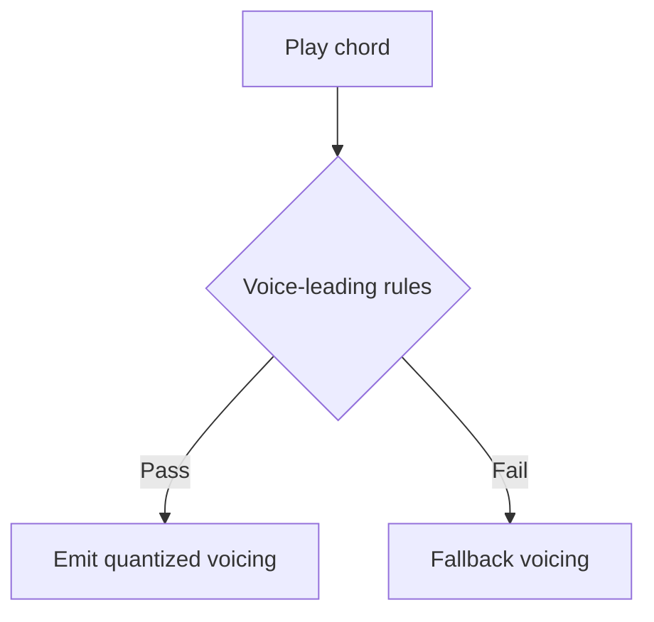

# ChordPallette — Documentation Repository

This repo is the **single source of truth** for all human-readable materials for the ChordPallette product:
- product vision & UX
- technical specs
- feature docs
- marketing strategy & launch planning
- sales copy, press kit, investor materials

## How to use
- All site content lives in `/docs`.
- Static site generator ready (MkDocs recommended). See `mkdocs.yml`.
- Add new documents as Markdown files in the appropriate folder.
- Keep docs **human-first**: clear headings, short sections, examples.

## Local setup
1. Install dependencies:
   ```bash
   pip install mkdocs mkdocs-material pymdown-extensions
   ```
2. Rebuild navigation:
   ```bash
   python scripts/generate_nav.py
   ```
3. Start local development server:
   ```bash
   mkdocs serve
   ```
4. Build static site output:
   ```bash
   mkdocs build
   ```

## Mermaid flowcharts
Mermaid flowcharts are enabled through MkDocs + `pymdownx.superfences` and a Mermaid initializer script.

Use fenced blocks like:



## VS Code tasks (Command Palette)
This repo includes `.vscode/tasks.json` tasks so you can launch docs workflows from **Command Palette → Tasks: Run Task**:

- `Docs: Rebuild Navigation` — one-time `mkdocs.yml` nav generation.
- `Docs: Watch + Auto Rebuild Navigation` — watches `docs/**/*.md` and regenerates nav when files change.
- `Docs: Serve Local Site` — runs `mkdocs serve` (depends on one nav rebuild first).
- `Docs: Start Dev (Serve + Auto Nav Rebuild)` — starts serving and nav auto-rebuild in parallel.

Recommended daily workflow:
1. Run `Docs: Start Dev (Serve + Auto Nav Rebuild)`.
2. Open the local MkDocs URL shown in terminal (typically `http://127.0.0.1:8000`).
