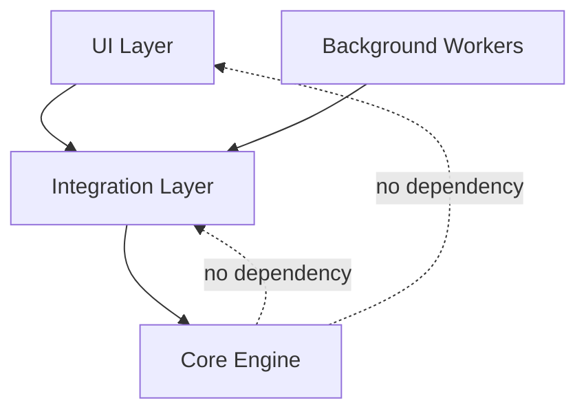

# Architecture Principles

These principles are the long-lived contracts for ChordPallette architecture decisions.

## 1. Separate Core From Integration

- Core defines musical behavior and deterministic transforms.
- Integration adapts host/plugin concerns and marshals data to Core.
- UI consumes snapshots and commands; it does not own musical truth.

## 2. Keep the Audio Thread Predictable

- No blocking calls, no unbounded loops, no hidden allocations.
- Any expensive work must move to message thread or worker thread.
- Runtime behavior must be deterministic for identical input + config.

See [Realtime Safety](realtime-safety.md) and [Threading and Lifecycle](threading-and-lifecycle.md).

## 3. Preserve Non-Destructive Editing

- Base chord/state remains stable unless user performs an explicit freeze/commit.
- Operators and overlays are reversible influences, not silent mutations.
- History should capture user intent and remain replayable.

See [Playability Overlays Spec](playability-overlays-spec.md).

## 4. Enforce Clear Ownership

- Every subsystem has one source of truth.
- Cross-layer communication is explicit (snapshots, immutable config, scoped commands).
- Avoid "convenience" shortcuts that bypass layer boundaries.

See [Module Boundaries](module-boundaries.md).

## 5. Treat Persistence as a Product Contract

- Serialization shape and migration rules are compatibility surface area.
- Changes to saved data must be versioned, testable, and rollback-aware.

See [Migration, Serialization, and Undo](ChordPallette_Migration_Serialization_UndoRedo.md).

## 6. Bias Toward Bounded Algorithms

- Candidate generation and scoring must have explicit limits.
- Style profiles tune weights, not computational complexity class.
- Prefer cacheable deterministic heuristics over open-ended search.

## 7. Make Behavior Explainable

- Output should be traceable to known inputs, settings, and style rules.
- UX should expose "why this happened" without coupling UI strings to core logic.

## Dependency Direction

## Related Docs

- [Architecture Overview](architecture-overview.md)
- [Current Baseline](current-baseline.md)
- [Invariants](../guidelines/invariants.md)
