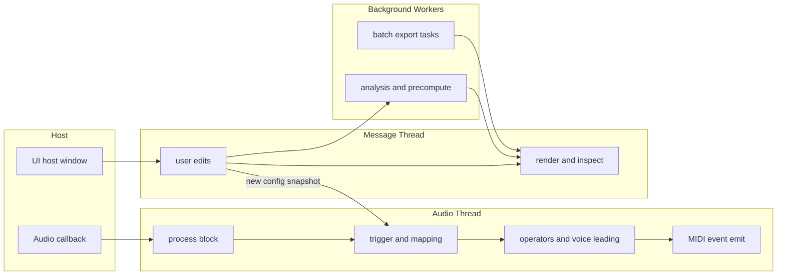
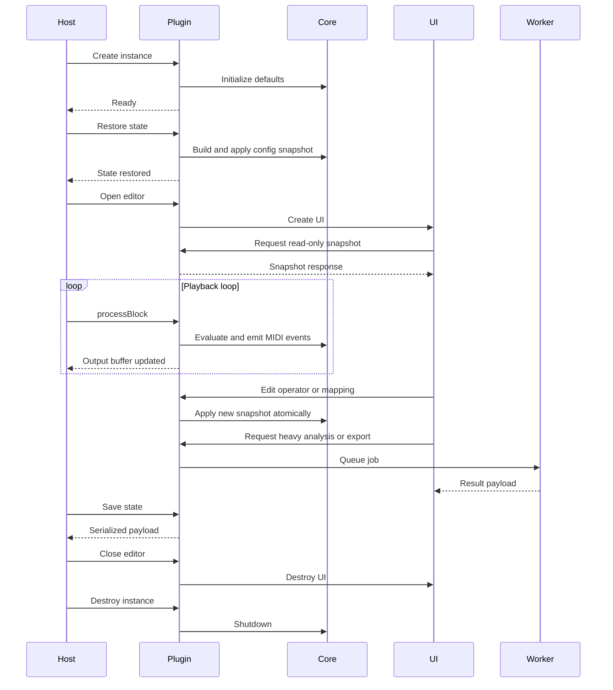

# Threading and Lifecycle

This document defines thread ownership and plugin lifecycle behavior so engineering, UX, and docs all describe the same runtime model.

## Thread Ownership Model

### Audio Thread (Realtime)

Owns:

- trigger processing during playback
- bounded operator and voice-leading evaluation
- MIDI event emission

Must never do:

- heap allocation
- lock waits
- file IO
- expensive string/UI work

### Message Thread (UI)

Owns:

- rendering and interaction
- control edits and command intent
- explainability text and labels

Must never block the audio callback.

### Worker Threads (Background)

Own:

- batch analysis
- long-running precompute
- heavy export generation

Publish results back through safe handoff to Integration/UI.

## Threading Diagram

## UI to Audio Handoff Contract

Preferred pattern:

1. UI builds complete immutable config snapshot.
2. Integration atomically swaps active snapshot pointer/version.
3. Audio thread consumes only stable snapshot.
4. Retired snapshots are reclaimed off audio thread.

## Lifecycle Sequence

## State Restore Ordering

Restore order should be:

1. deserialize persisted parameter/model state
2. build complete runtime snapshot
3. atomically publish snapshot to runtime
4. allow UI to rehydrate from same snapshot

This avoids partial state visibility and first-block mismatch behavior.

## Related Docs

- [Realtime Safety](realtime-safety.md)
- [Module Boundaries](module-boundaries.md)
- [Current Baseline](current-baseline.md)
