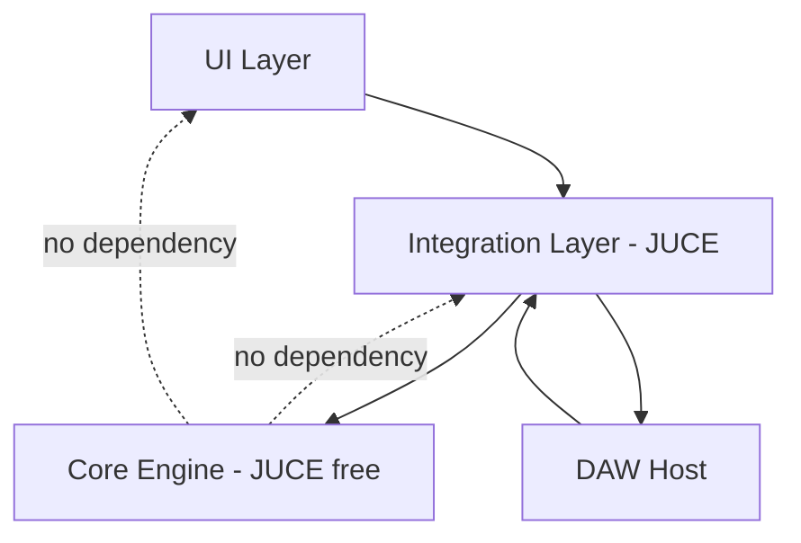
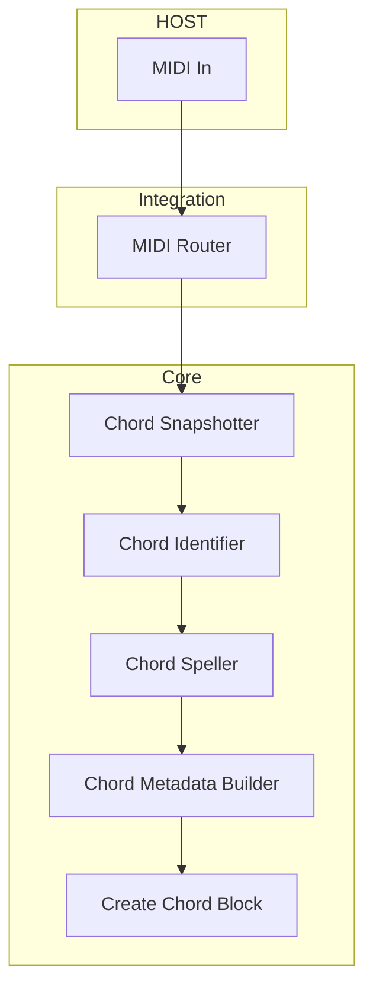
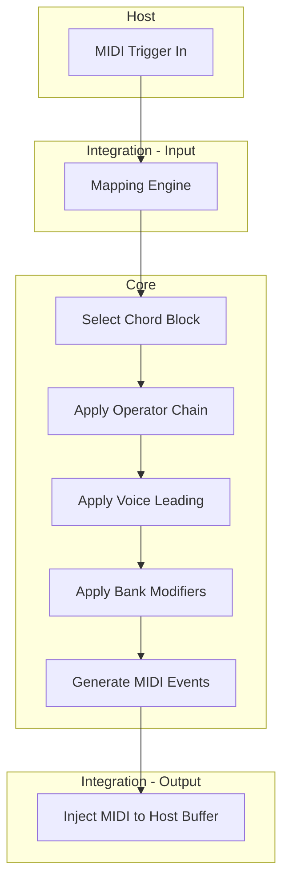

> **Archived (non-authoritative):** This file is retained for historical reference only. Use canonical pages from the main navigation for current guidance.

# ChordPallette — Architecture Principles

This document defines the architectural philosophy, dependency rules, and processing boundaries for ChordPallette.

The goal is to ensure:

- Real-time safety
- Long-term maintainability
- Extensibility
- Portability across plugin formats
- Clear mental models for contributors
- Predictable musical behavior

---

# 1. Core Philosophy

ChordPallette is built around a strict separation between:

- Core (JUCE-free musical engine)
- Integration (JUCE + host adaptation layer)

This separation is non-negotiable.

> The Core defines musical truth.  
> The Integration layer adapts that truth to the DAW and UI.

---

# 2. Architectural Principles

## 2.1 Single Responsibility

Each layer has a single job:

Layer | Responsibility
------|---------------
Core | Musical logic and transformations
Integration | Host IO, routing, persistence, rendering
UI | Visualization and user interaction
Host | Execution environment

No layer should assume responsibilities outside its domain.

---

## 2.2 Core Must Be Framework-Agnostic

The Core:

- Must compile without JUCE
- Must not reference plugin APIs
- Must not allocate dynamically on the real-time path
- Must be testable independently

Why:

- Enables CLI tools, standalone apps, and future portability
- Keeps musical intelligence reusable
- Makes unit testing possible

---

## 2.3 Integration Must Be Thin

Integration:

- Routes MIDI in/out
- Adapts Core output to host buffers
- Manages state via APVTS
- Binds UI controls to Core config objects

Integration must NOT:

- Contain chord logic
- Reimplement detection
- Perform heavy transforms
- Modify musical data beyond routing

---

## 2.4 Real-Time Safety First

All code executed inside processBlock must be:

- Bounded in time
- Allocation-free
- Lock-free
- Deterministic

Heavy tasks must run:

- On background threads
- In UI thread
- During bake/export operations

Never in the audio thread.

---

## 2.5 Non-Destructive Engine Model

The Core engine operates on immutable base objects:

- BaseChord remains unchanged
- Operators produce derived states
- Bank modifiers produce final output states
- Freeze operations explicitly create new base states

This ensures:

- Undo/redo safety
- Reliable exports
- Predictable transformations
- User trust

---

## 2.6 Bounded Complexity

Every algorithm must have:

- A capped candidate set
- Deterministic runtime
- A worst-case time budget

Example:

Voice Leading:
- Max 32–64 candidate voicings
- Simple cost function
- Cached results for repeated transitions

---

# 3. Dependency Rules

The dependency direction is strictly one-way.

UI  
↓  
Integration  
↓  
Core  

Core depends on nothing above it.

Integration depends on Core.

UI depends on Integration (and optionally read-only Core interfaces).

---

# 4. Dependency Flow Diagram

Important Rule:
Core must never depend on Integration or UI.

---

# 5. Annotated MIDI Processing Tree

Below is the full processing tree with layer boundaries marked.

---

## 5.1 Record / Capture Mode

Layer Notes:

Host:
- Supplies MIDI events

Integration:
- Routes capture vs performance streams

Core:
- Detects chord
- Assigns names and notation
- Constructs ChordBlock data structure

---

## 5.2 Performance / Playback Mode

---

# 6. Real-Time Boundary

Everything inside this path must be RT-safe:

Trigger  
→ Mapping  
→ Operator chain  
→ Voice leading  
→ Bank modifiers  
→ MIDI event generation  

Allowed:

- Fixed arrays
- Preallocated buffers
- Small loops
- Cached lookups

Not allowed:

- Memory allocation
- String processing
- Chord naming logic
- UI calls
- File IO

---

# 7. Why This Architecture Matters

Without clear boundaries:

- Audio thread instability increases
- Features become entangled
- Testing becomes impossible
- Refactoring becomes dangerous
- Performance becomes unpredictable

With clear boundaries:

- Core can evolve safely
- Integration remains minimal
- UI can be redesigned without breaking engine
- Plugin formats (VST3/AU/Standalone) stay aligned
- Performance tool remains reliable under stress

---

# 8. Long-Term Extensibility

Because Core is isolated:

You can later add:

- AI-assisted chord suggestion
- Cloud sync
- Mobile companion app
- Batch MIDI processing tool
- Web-based chord explorer

Without rewriting the musical engine.

---

# 9. Mental Model Summary

Core = Musical Brain  
Integration = Nervous System  
UI = Face & Hands  
Host = Environment  

The brain does not know what the face looks like.  
The hands do not contain the brain.  

Separation ensures stability.

---

End of Architecture Principles Document.
