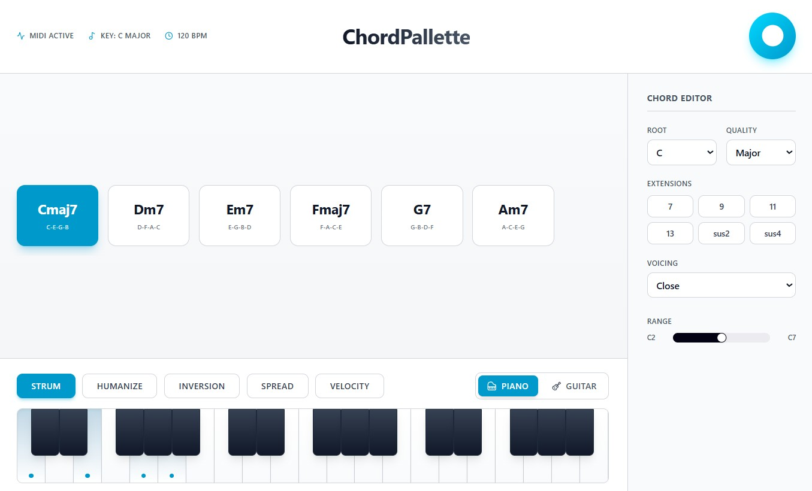
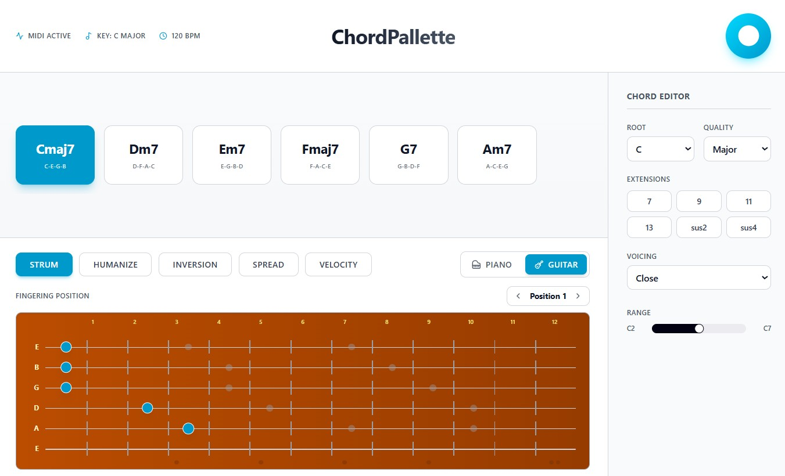

# ChordPallette Docs

Welcome to the documentation repo for **ChordPallette** — a performance-driven chord capture + voicing instrument.

Use the navigation to find:
- product definition and principles
- feature docs (including Voice Leading)
- technical specs and architecture notes
- UX/brand guidelines
- marketing strategy, launch plans, and copy
- sales and investor materials

> Keep everything here **human-readable**, even when it’s technical.
 
<!-- reload-test: 2026-02-14  -->
